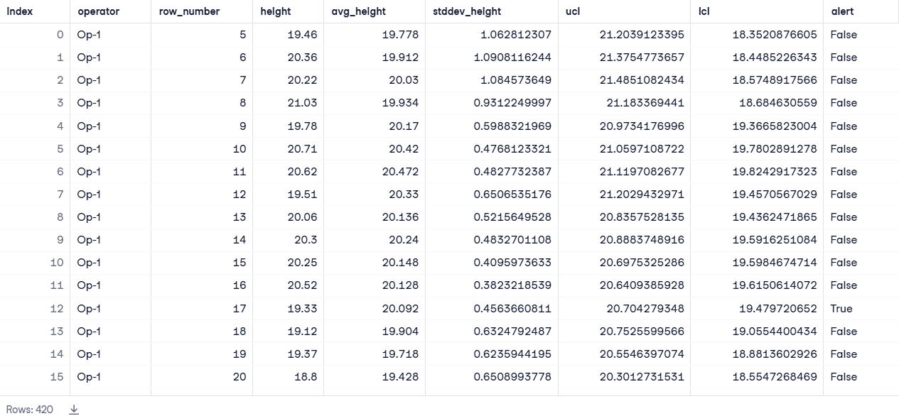

# Statistical Process Control (SPC) for Manufacturing Data

Monitoring manufacturing processes is crucial for ensuring consistent product quality. This project focuses on evaluating product heights and flagging deviations from acceptable control limits using Statistical Process Control (SPC). By leveraging SQL window functions, the project identifies points where the process may need adjustment, helping manufacturers maintain high-quality production.

## Objectives
1. Analyze the manufacturing process by evaluating the **height** of products to determine whether the process operates within acceptable **control limits (UCL/LCL)**.
2. Create a **boolean alert flag** for each operator to signal whether a product height falls outside the defined control limits.
3. Save the final output as a DataFrame called **alerts**, containing key metrics for process monitoring.

## Dataset Description
The project analyzes data from the **manufacturing_parts** table, which includes:
- **item_no** - The item number.
- **length** - The length of the manufactured item.
- **width** - The width of the manufactured item.
- **height** - The height of the manufactured item.
- **operator** - The operating machine.

## Installation
Clone this repository and install the necessary libraries:
```bash
git clone https://github.com/JReaves10/ManufacturingProcess
cd ManufacturingProcess
```
- set up your SQL environment and ensure access to the manufacturing_parts table.
- Execute the provided SQL query to generate the alerts DataFrame.

## Code Explanation
### 1. Calculating Control Limits
The control limits are defined as: **Upper Control Limit (UCL)** & **Lower Control Limit (LCL)**:


### 2. Window Functions for Calculations
- The query uses window functions to calculate moving averages and standard deviations:
- This block creates a window of length 5 for each operator, calculating metrics for rows up to the current row while excluding incomplete windows.


### 3. Filtering and Control Limit Calculation
This ensures only complete windows are included in the final query output.


### 4. Generating Alerts
The alert flag is set to TRUE if a product height falls outside the control limits:


### 5. Final Query Output
The final query returns the following fields:
- **operator** - The operating machine.
- **row_number** - Sequential row number.
- **height** - Height of the manufactured item.
- **avg_height** - Moving average of height.
- **stddev_height** - Moving standard deviation of height.
- **ucl** - Upper Control Limit.
- **lcl** - Lower Control Limit.
- **alert** - Boolean flag indicating whether the height is within control limits.

### Results
The query generates a DataFrame alerts, containing key process metrics and an alert flag.



## Conclusion
This project implements Statistical Process Control (SPC) to enhance monitoring and control of the manufacturing process. By generating alerts for out-of-control product measurements, it supports improved process consistency and product quality.

#### Technology Used
- Language: **SQL**
- Concepts: **Statistical Process Control (SPC)**, **Window Functions**, **Data Partitioning**, **Control Limits**
